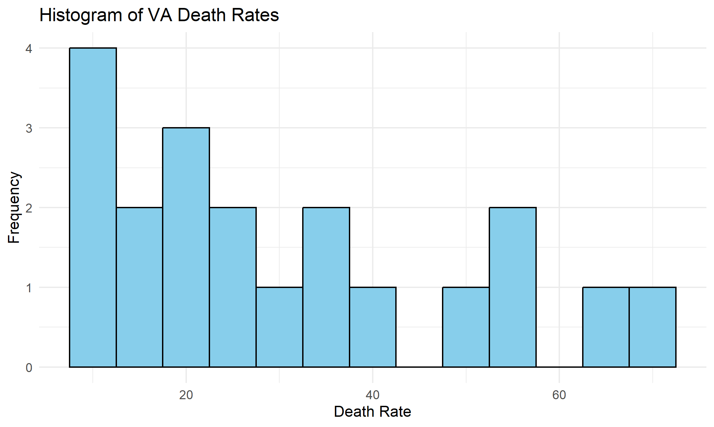
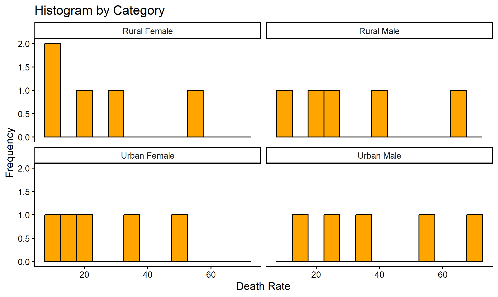
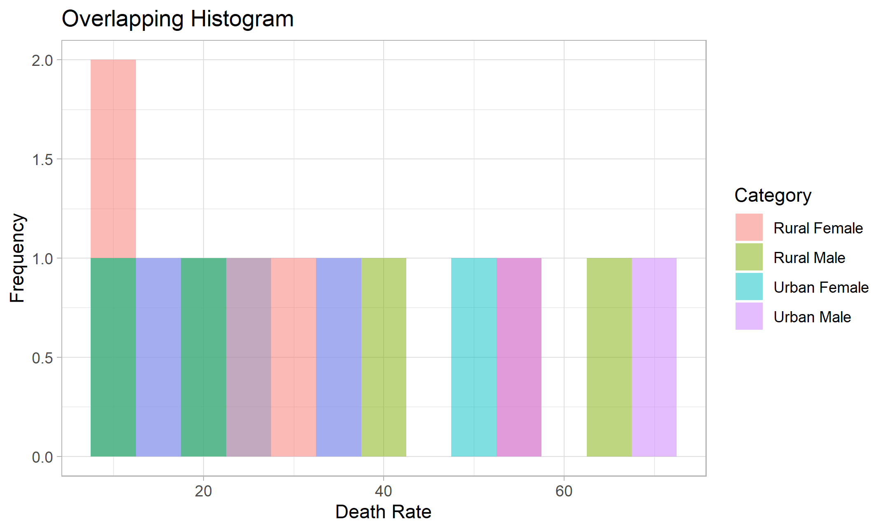

# dv-template
DV Lab Template Repository
# Data Visualization Lab

## Week 1A
**Script:** `scripts/week1a_script.R`  

**Output Plots:**

---

## Week 1B
**Script:** `scripts/week1b_script.R`

(plots not added yet)

---

## Week 2
**Script:** `scripts/week2_script.R`

---

## Week 3A
**Script:** `scripts/week3a_script.R`

---

## Week 3B
**Script:** `scripts/week3b_script.R`

---

## Week 4A
**Script:** `scripts/week4a_script.R`

---

## Week 4B
**Script:** `scripts/week4b_script (1).R`

---
